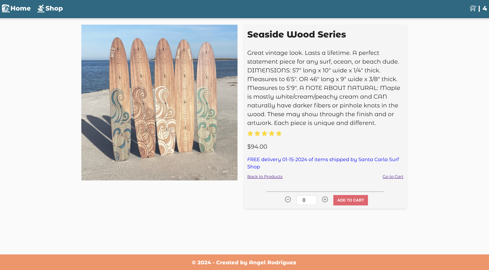

# React Shopping Cart - Santa Carla Surf Shop

  

  

  

  <a href="https://santacarlasurf.netlify.app/" target="_blank">Live Site</a>
  

Welcome to Santa Carla Surf Shop, a vibrant, colorful shopping cart app built using React for the Odin Project.

## Features

- Responsive Design: Optimized for all screen sizes.
- Product Gallery: Browse through a curated (fake) collection of surfboards.
- Cart Functionality: Add items to your cart, adjust quantities, and proceed to checkout.
- Product Detail Pages: Detailed information on each product.
- Smooth loading animations.

## Technologies Used

- React: For building the user interface.
- SCSS: For stylish and responsive designs.
- Context API: For state management across the application.
- React Router: For navigation and routing within the app.
- FontAwesome & React Icons: For adding icons.
- Quickbase API: For fetching product data.
- LocalStorage: For cart data persistence.

## Gallery

## Installation and Setup

To get this project up and running on your local machine, follow these steps:

1. Clone the Repository

- `git clone https://github.com/your-username/santa-carla-surf-shop.git`

- `cd santa-carla-surf-shop`

2. Install Dependencies

- `npm install`

3. Set Environment Variables

- Create a .env file in the root directory and add the necessary API keys and endpoints.

4. Run the Application

- `npm run dev`\
  This will start the development server on port 5173.
